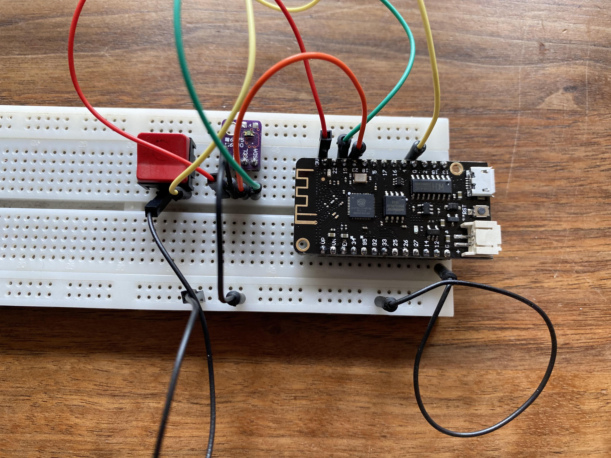
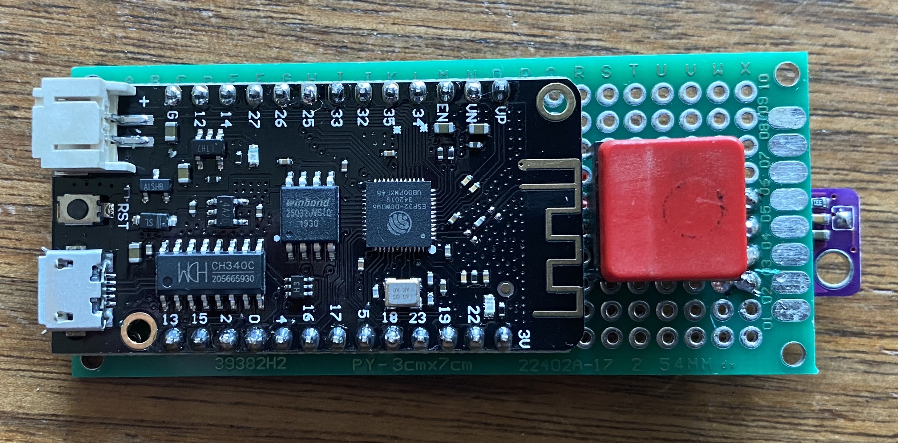
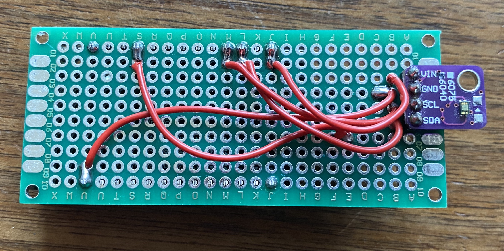

# iotsaRGBWSensor

Light sensor that detects RGB, White and ambient light using a VEML6040 color sensor.

Based on [iotsa](https://github.com/cwi-dis/iotsa).

The sensor uses a cheap AliExpress VEML6040 board (you may have to de-solder the white LED if
you want to take emitted/ambient light readings, as opposed to measuring the color of objects).

The VEML6040 is described in <https://www.vishay.com/docs/84276/veml6040.pdf> with additional
design information available at <https://www.vishay.com/docs/84331/designingveml6040.pdf>.

The interface library used is <https://github.com/thewknd/VEML6040>

## Hardware construction

Any esp32 board will do. I have used a lolin 32 lite, because it has a LiPo charger on the board. Here is the breadboard layout:

Connections to be made:

- GND to VEML GND, pushbutton
- 3V to VEML VCC
- GPIO19 to VEML SDA
- GPIO23 to VEML SCL
- GPIO0 to pushbutton

After the breadboard work I've transferred the components to a solderboard. It's not a work of art, I wanted the sensor on the bottom of the board for easier measurement, but that led to routing problems. But it works:

At some point I will design a 3d-printed case.

See the note above about desoldering the bright white LED on the VEML.

## Software installation

- Build using Platformio. 
- Flash to the board over USB.
- Board will create a WiFi hotspot `config-xxxxxxx`.
- Connect to that WiFi, browse to <http://192.168.4.1>, configure hostname (lets say `colorsensor` for this example), WiFi SSID and Password. You may have to reset the board to switch to configuration mode, it will tell you.
- Reset the board, it will connect to your wifi with hostname `colorsensor.local`.
- Browse to battery config. Set sleep mode to _Deep Sleep_, wake time to _60000_.

## Usage

Boot the board. If you have set the battery config above the board will go to deep sleep after 60 seconds of inactivity (saving battery). Pressing the button will wake it again, or keep it awake for another 60 seconds. Accessing the web or REST interface will also keep it awake for another 60 seconds.

Point the sensor at whatever light (or lit surface) you want to measure.

Read the results with a browser to <http://colorsensor.local/rgbw> in human-readable form, or <http://colorsensor.local/api/rgbw> as JSON (REST interface).

You can reflash the board over the air, see [iotsa](https://github.com/cwi-dis/iotsa) for details. Tapping the button 3 times will enable OTA mode or config mode (after being requested over the net), tapping it 6 times will force a reboot.